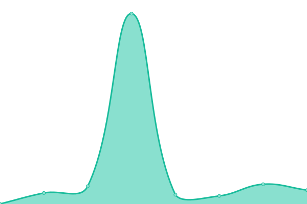

# [📈 Live Status](https://unix0r.github.io/upptime): <!--live status--> **🟧 Partial outage**

This repository contains the open-source uptime monitor and status page for [Artur Dick](https://unix0r.github.io/upptime), powered by [Upptime](https://github.com/upptime/upptime).

With [Upptime](https://upptime.js.org), you can get your own unlimited and free uptime monitor and status page, powered entirely by a GitHub repository. We use [Issues](https://github.com/unix0r/upptime/issues) as incident reports, [Actions](https://github.com/unix0r/upptime/actions) as uptime monitors, and [Pages](https://unix0r.github.io/upptime) for the status page.

<!--start: status pages-->
<!-- This summary is generated by Upptime (https://github.com/upptime/upptime) -->
<!-- Do not edit this manually, your changes will be overwritten -->
<!-- prettier-ignore -->
| URL | Status | History | Response Time | Uptime |
| --- | ------ | ------- | ------------- | ------ |
|  [Dick-Technology](https://dick-technology.de) | 🟩 Up | [dick-technology.yml](https://github.com/unix0r/upptime/commits/HEAD/history/dick-technology.yml) | 

 340ms
     
 | 

<a href="https://unix0r.github.io/upptime/history/dick-technology">100.00%</a>
    

|  [Synology](https://synology.dick-technology.de) | 🟥 Down | [synology.yml](https://github.com/unix0r/upptime/commits/HEAD/history/synology.yml) | 

 4546ms
     
 | 

<a href="https://unix0r.github.io/upptime/history/synology">99.57%</a>
    

|  [Nextcloud](https://cloud.dick-technology.de) | 🟥 Down | [nextcloud.yml](https://github.com/unix0r/upptime/commits/HEAD/history/nextcloud.yml) | 

 7763ms
     
 | 

<a href="https://unix0r.github.io/upptime/history/nextcloud">93.56%</a>
    

|  [Bitwarden](https://bitwarden.dick-technology.de) | 🟥 Down | [bitwarden.yml](https://github.com/unix0r/upptime/commits/HEAD/history/bitwarden.yml) | 

 3520ms
     
 | 

<a href="https://unix0r.github.io/upptime/history/bitwarden">95.71%</a>
    

|  [SEAD e.V](https://sead-ev.de) | 🟩 Up | [sead-e-v.yml](https://github.com/unix0r/upptime/commits/HEAD/history/sead-e-v.yml) | 

 2471ms
     
 | 

<a href="https://unix0r.github.io/upptime/history/sead-e-v">100.00%</a>
    

|  [NaRi e.V](https://nari-ev.de) | 🟩 Up | [na-ri-e-v.yml](https://github.com/unix0r/upptime/commits/HEAD/history/na-ri-e-v.yml) | 

 370ms
     
 | 

<a href="https://unix0r.github.io/upptime/history/na-ri-e-v">100.00%</a>
    

|  [Alevtina-Wellness](https://alevtina-wellness.de) | 🟩 Up | [alevtina-wellness.yml](https://github.com/unix0r/upptime/commits/HEAD/history/alevtina-wellness.yml) | 

 2626ms
     
 | 

<a href="https://unix0r.github.io/upptime/history/alevtina-wellness">100.00%</a>
    

<!--end: status pages-->

[**Visit our status website →**](https://unix0r.github.io/upptime)

## 📄 License

- Powered by: [Upptime](https://github.com/upptime/upptime)
- Code: [MIT](./LICENSE) © [Anand Chowdhary](https://anandchowdhary.com), supported by [Pabio](https://pabio.com)
- Data in the `./history` directory: [Open Database License](https://opendatacommons.org/licenses/odbl/1-0/)
